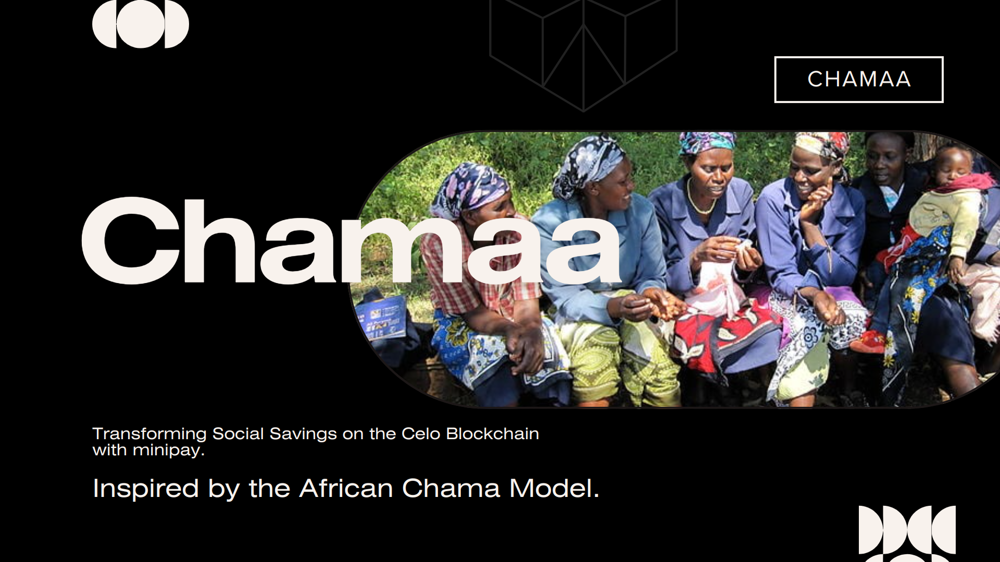

# Chamaa - Collaborative Social Savings

## By Dennis Kimathi | Ronnex Ondimu | Antony Kimani

## Screenshot
 


 ## Table of Content
 - [About Chamaa](#chamaa)
 - [Demo Video](#demo-video)
 - [Pitch Deck](#pitch-deck)
 - [Features](#features)
 - [Requirements](#requirements)
 - [Installation Process](#installation-Process)
 - [Live Link](#Live-Link)
 - [Technology  Used](#technology-Used)
 - [License](#license)
 - [Authors Info](#Authors-Info)


## About Chamaa

Chamaa is a revolutionary DApp, inspired by the traditional African Chama model. It aims to empower communities globally by providing a decentralized platform for collaborative social savings.

With a focus on financial inclusion, Chamaa utilizes the stablecoins to offer a stable and accessible currency, making it a hedge against inflation, especially in African countries. The app is designed to be inclusive, leveraging Minipay on the Opera Mini browser for usability in low-data network environments. Chamaa is not just a financial tool; it's a community-driven initiative fostering economic empowerment and resilience.

Inorder to enhance the app's security and trustworthiness by using decentralized identity verification for pool creation, joining, and claiming contributions. Privado ID would allow users to prove their identity and reputation without revealing personal information. For instance, when creating or joining savings pools, users could present verifiable credentials to ensure they are trustworthy members. This would help prevent fraud and improve community trust, while maintaining privacy and promoting inclusivity within the app.

## Demo video


[Go Back to the top](#Chamaa-Dapp-Web-app)

## Pitch Deck

- [Presentation](https://www.canva.com/design/DAF0i4Vn-7g/rXEvZ28I8Nc6vIU5gwjylQ/edit?utm_content=DAF0i4Vn-7g&utm_campaign=designshare&utm_medium=link2&utm_source=sharebutton)

## Features
1. As a user, I want to create a savings pool to save with friends.
2. As a user, I want to join non-restricted pools to save with other people.
3. As a user, I want to contribute to a savings pool using cUSD.
4. As a user, I want to claim contributions when its my turn. 

 ###  Requirements
 * Access to  a computer 
 * Access to internet

 ### Installation Process
 ****
* Clone to the repo : git clone hhttps://github.com/DennohKim/social-saving-pool-bwc4
* In the root directory, run the following command to install the packages ``` yarn```.
* Run `yarn react-app:dev` to launch the app

 ****

### Live Link
- Click this link to view the live application https://social-saving-pool-bwc4-react-app.vercel.app/

### Technology  Used

- [Celo-composer](https://github.com/celo-org/celo-composer)
- [Privado](https://www.privado.id/)
- [Celo Blockchain](https://celo.org/)
- [Solidity](https://docs.soliditylang.org/en/v0.8.19/)
- [Next.js](https://nextjs.org/)
- [React.js](https://reactjs.org/)
- [Shadcn UI](https://ui.shadcn.com/)
- [Rainbowkit-celo](https://github.com/celo-org/rainbowkit-celo)
- [Social-Connect](https://github.com/celo-org/SocialConnect#-exampleshttps://github.com/celo-org/SocialConnect#-examples)


## License
MIT License
Copyright (c) [2023] [License](LICENSE.txt)
Permission is hereby granted, free of charge, to any person obtaining a copy
of this software and associated documentation files (the "Software"), to deal
in the Software without restriction, including without limitation the rights
to use, copy, modify, merge, publish, distribute, sublicense, and/or sell
copies of the Software, and to permit persons to whom the Software is
furnished to do so, subject to the following conditions:
The above copyright notice and this permission notice shall be included in all
copies or substantial portions of the Software.
THE SOFTWARE IS PROVIDED "AS IS", WITHOUT WARRANTY OF ANY KIND, EXPRESS OR
IMPLIED, INCLUDING BUT NOT LIMITED TO THE WARRANTIES OF MERCHANTABILITY,
FITNESS FOR A PARTICULAR PURPOSE AND NONINFRINGEMENT. IN NO EVENT SHALL THE
AUTHORS OR COPYRIGHT HOLDERS BE LIABLE FOR ANY CLAIM, DAMAGES OR OTHER
LIABILITY, WHETHER IN AN ACTION OF CONTRACT, TORT OR OTHERWISE, ARISING FROM,
OUT OF OR IN CONNECTION WITH THE SOFTWARE OR THE USE OR OTHER DEALINGS IN THE
SOFTWARE.

## Authors Info

Contributors  
- [Dennis Kimathi](https://github.com/DennohKim)
- [Ronnex Ondimu](https://github.com/RonexLemon)
- [Ibrahim Aziz](https://github.com/ibraziz21)

 

[Go Back to the top](#Chamaa-Dapp-Web-app)
